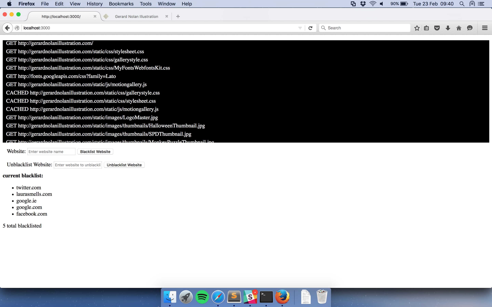
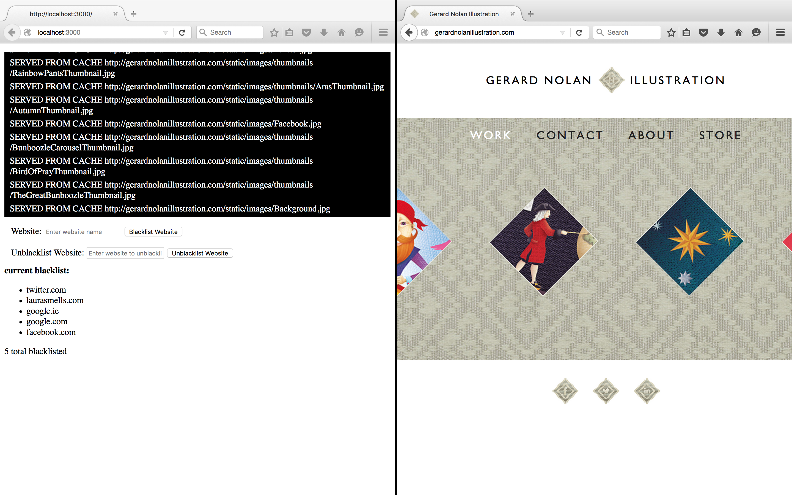

# Web-Proxy
A http and https Web Proxy that implements caching and blacklisting with a management console available through a webpage that updates in real time written in Node.js.

# Installation
Run:
mysql -u root < proxyschema.sql
To set up the database.

Then run:
npm install package.json
To get all the required node modules.

Finally point your browser to proxy through local:8080 and run:
node ProxyServer.js

Now your proxy should be up and running and every web request will go through it!
Every http request will be cached if possible and all blacklisted websites will be completely blocked.

You can view the management console on localhost:3000 which will update every request and cache in real time.
 
</img>
An view of the management console.
 
</img>
A website being served from cache.
